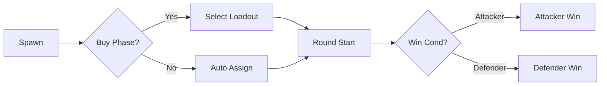

# Mermaid Diagrams

## Flow

```mermaid
flowchart LR
  A[Spawn] --> B{Buy Phase?}
  B -- Yes --> C[Select Loadout]
  B -- No --> D[Auto Assign]
  C --> E[Round Start]
  D --> E[Round Start]
  E --> F{Win Cond?}
  F -- Attacker --> G[Attacker Win]
  F -- Defender --> H[Defender Win]
```
