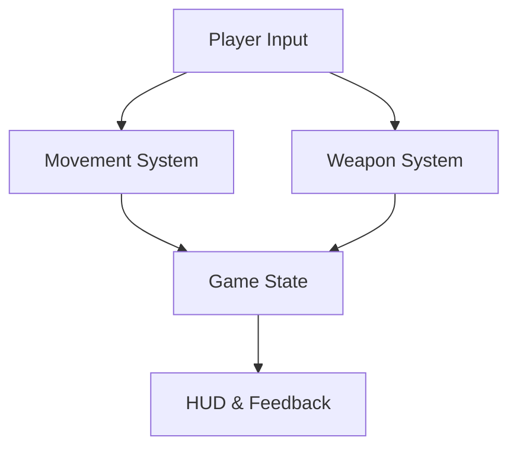

# 🎮 VirtualWarfare Docs

## 📊 High-Level Architecture

```mermaid
graph TD
  A[Player Input] --> B[Movement System]
  A --> C[Weapon System]
  B --> D[Game State]
  C --> D[Game State]
  D --> E[HUD & Feedback]
```
