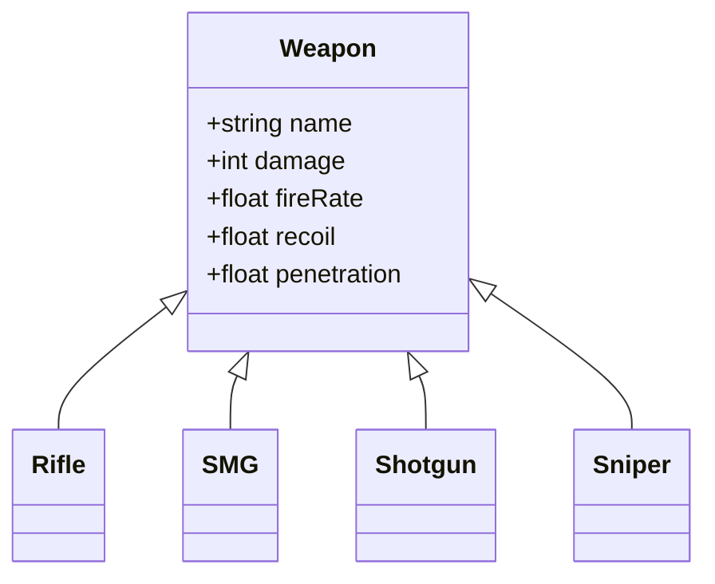

# 🔫 Weapons & Gadgets

## Class Diagram

```mermaid
classDiagram
  class Weapon {
    +string name
    +int damage
    +float fireRate
    +float recoil
    +float penetration
  }
  Weapon <|-- Rifle
  Weapon <|-- SMG
  Weapon <|-- Shotgun
  Weapon <|-- Sniper
```
- **C4** (Defenders only)
- **Flashbangs** (Attackers)
- **Smoke** (Both sides)
- **Revive Item** (Both sides)
